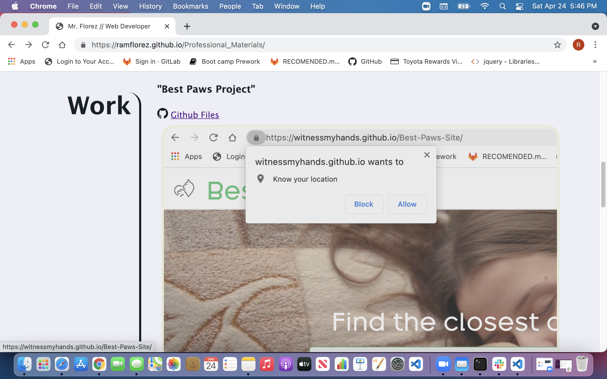
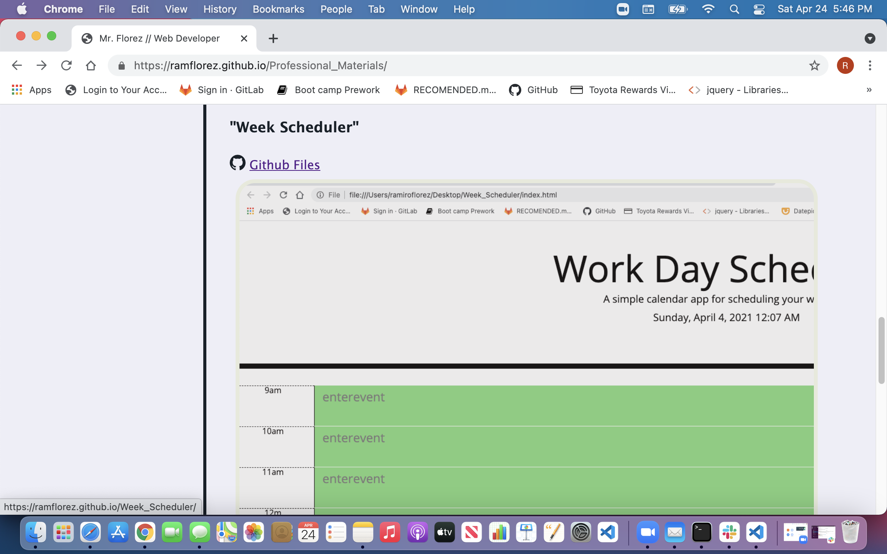
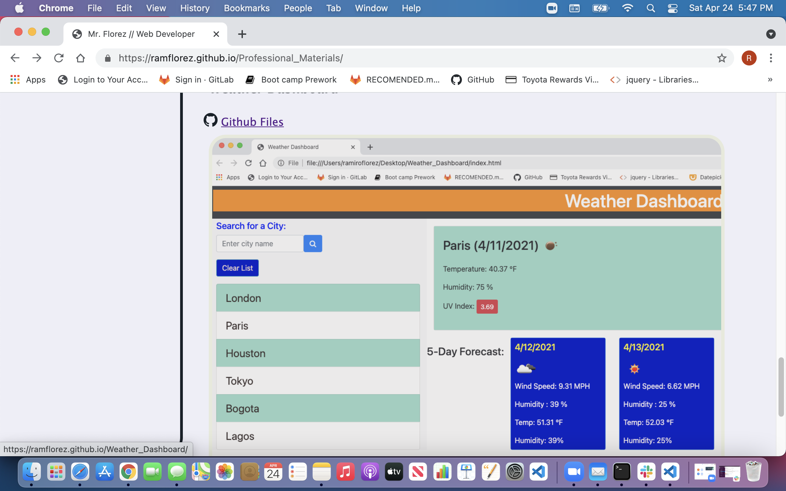
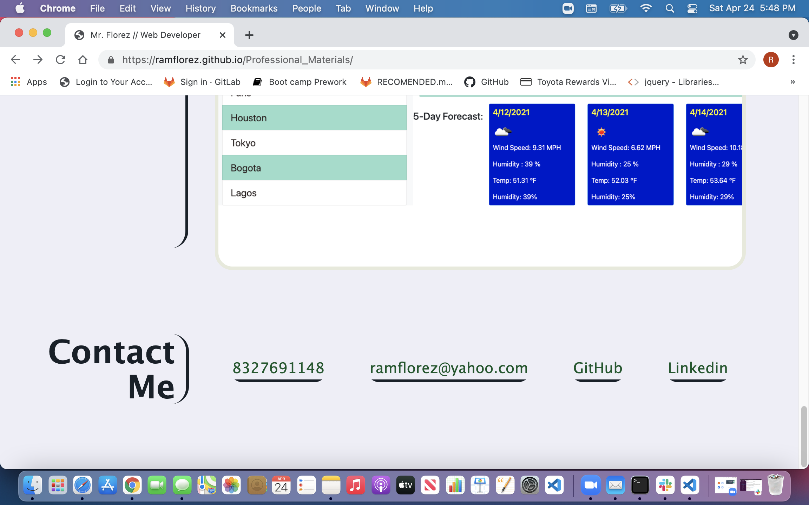

# Professional_Materials
This project updates my portfolio page. My profiles in Linkedin and Github are linked in the contact information. A downlable pdf file of my resume is also linked. This page features my first team project and two other assignments. Every project and assignment are identified by a title. They display links to the Github files under the title. The deployed snapshot links to the deployed page of the project or assignment. The contact information contains working links to my phone number, email and Github and Linkedin profiles.

LINKS

Deployed page in Github pages.
<https://ramflorez.github.io/Professional_Materials/>

Github files .
<https://github.com/ramflorez/Professional_Materials>

This is a snapshop of the header of the deployed page.

There are snapshops of the feautured project and assignments in the deployed page.

