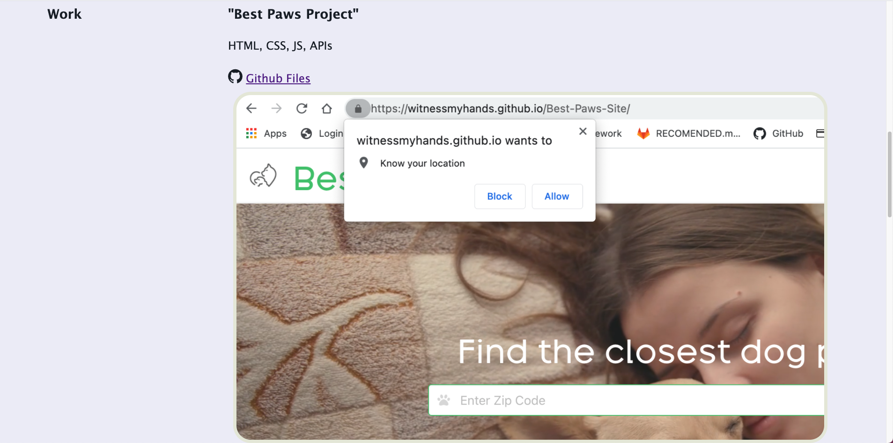
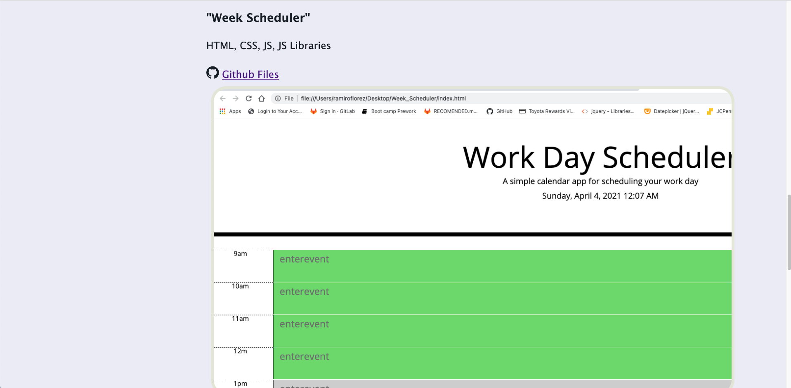
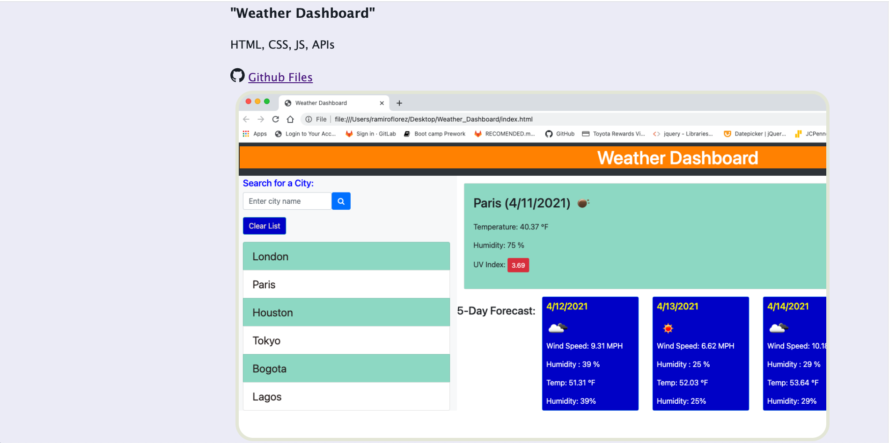

# Professional_Materials
This project updates my portfolio page. My profiles in Linkedin and Github are linked in the contact information. A downlable pdf file of my resume is also linked. This page features my first team project and two other assignments. Every project and assignment are identified by a title. Under the title, a Github icon precedes the clickable link to the Github files. Below these links, snapshots of the deployed pages of every project and assignment are placed. These snapshots are also clickable links to the correspondent deployed pages of each project and assignment. The contact information contains working links to my phone number, email as well as my Github and Linkedin profiles.

LINKS

Deployed page in Github pages.
<https://ramflorez.github.io/Professional_Materials/>

Github files .
<https://github.com/ramflorez/Professional_Materials>

This is a snapshop of the header of the deployed page.

These are snapshops of the featured project and assignments from the deployed page. Notice the Github icon followed by the link to the Github files (every snapshot links to the deployed pages).

Snapshot of the contact information section.

